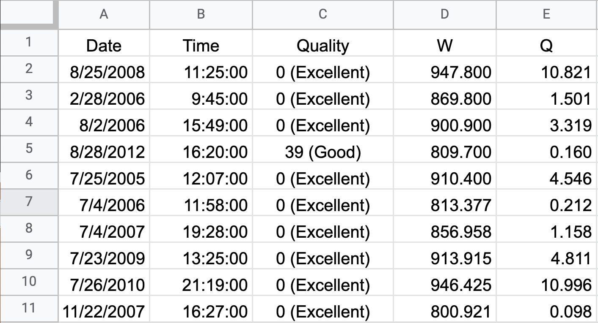
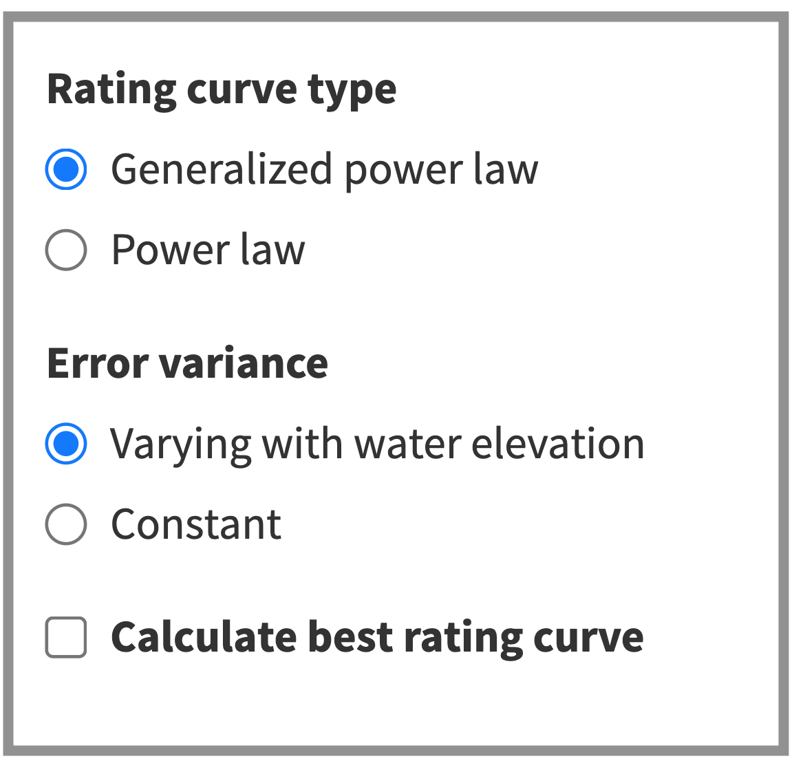
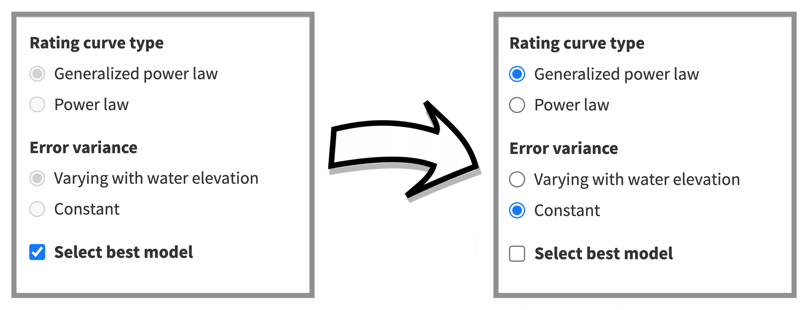
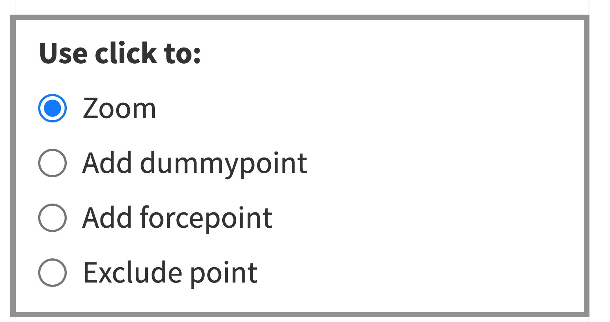
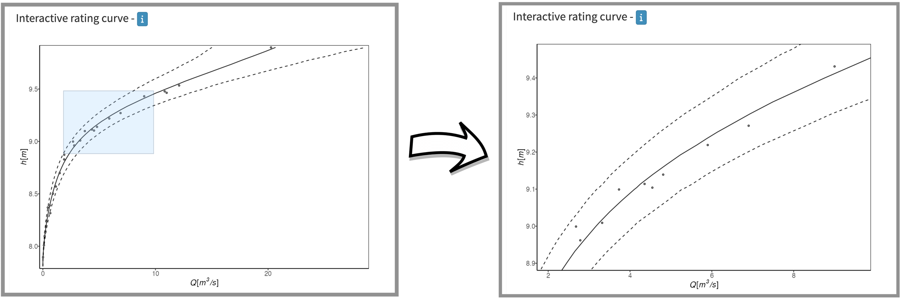
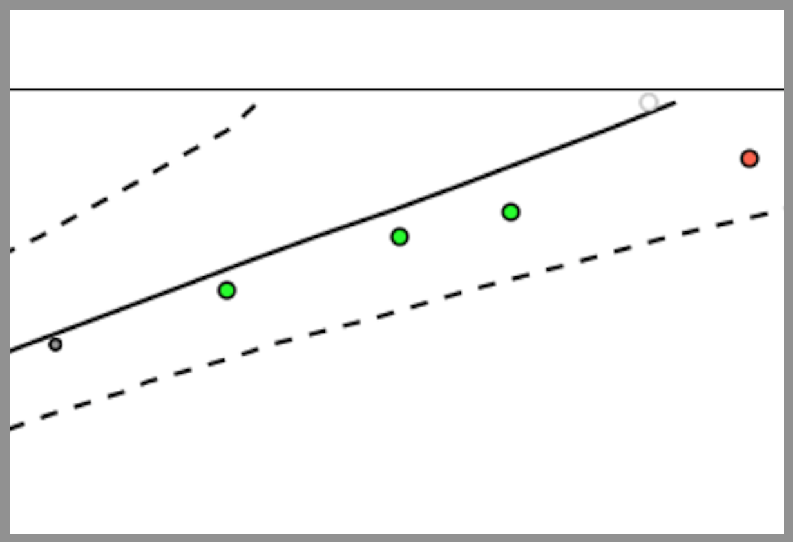
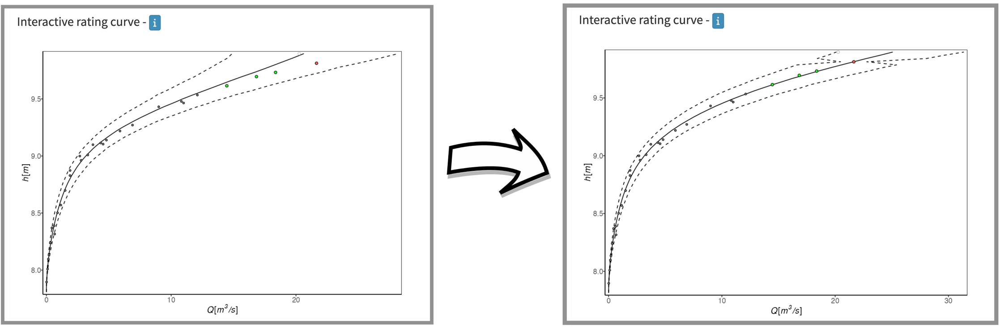
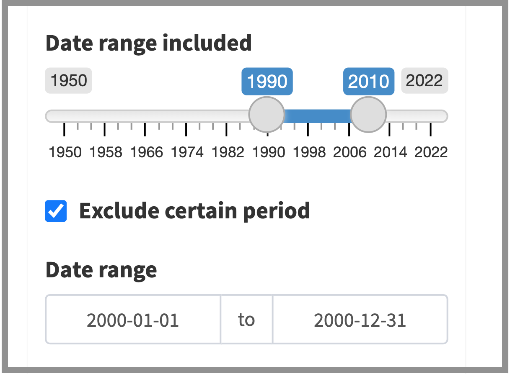
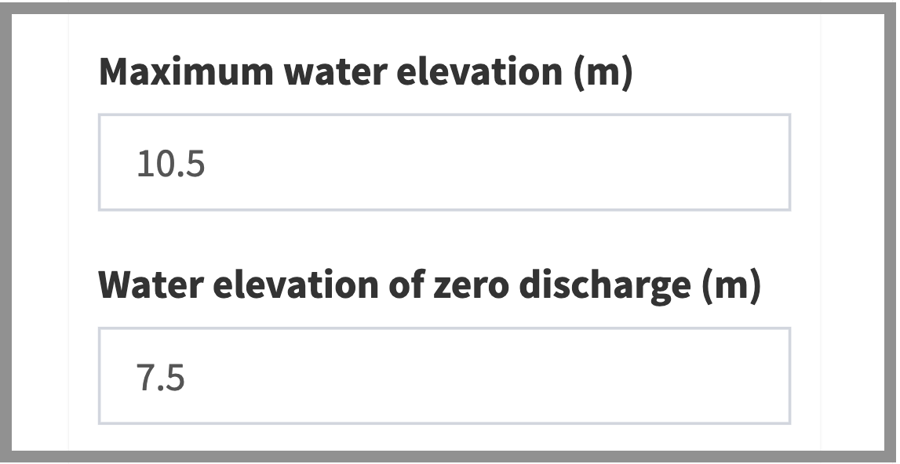
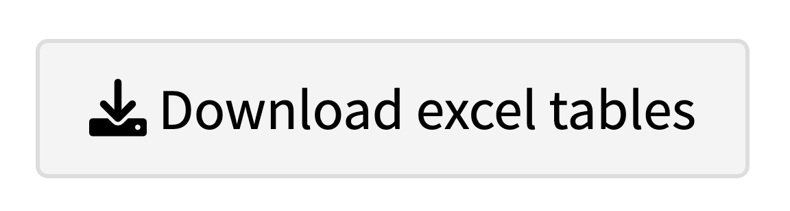

```{r, include = FALSE}
knitr::opts_chunk$set(
  collapse = FALSE,
  comment = "#>",
  fig.path='figs-introduction/',
  fig.align='center',
  prompt=T
)
```

## How to use the app?

This Shiny application can be used to generate a discharge rating curve from paired observations of water elevation (stage) and discharge. To start the data must be uploaded.

<br />

## 1. Upload data


To upload data, select the **Rating curve app** and push the **Browse** button in the **Controls** section

```{r, echo=FALSE, out.width = "325px"}
knitr::include_graphics("www/browse_pic.png")
```

Currently, the uploaded file must be an excel file (.xlsx) where the first row has the columns names **Date**, **Time**, **Quality**, **W** and **Q**. The format of the date and time columns should be as shown in the figure below, that is M/D/YYYY and HH:MM:SS, respectively. The measurement ratings, in the quality column, do not have to be in any specific format. And finally, the last two columns hold the water elevation (W) and discharge (Q) measurements in **centimeters** ($cm$) and **cubic meters per second** ($m^3/s$), respectively. Note that all entries in the dataframe must be complete! This means that all the cells must have a value in a valid format. A test file can be downloaded by pushing the **Download .xlsx test file** button above the Browse button. The test file (first 10 entries shown in the figure below) presents how the excel sheet should look in terms of the column names, and the format of the entries.

```{r, echo=FALSE, out.width = "500px"}

```

<br />

## 2. Selecting a Rating Curve Model

Once the data is uploaded, then the Rating Curve Model can be specified. There are two model characteristics that can be adjusted to select the model complexity. First, the **Rating curve type** can be set to either **Generalized power Law** or **Power law**. This setting specifies the type of rating curve that the mean of the model is set to follow. In simple terms; the generalized power-law rating curve is more flexible and is able to give a convincing fit to a greater number of datasets. For this reason, it is selected as the default type. For more details on these rating curve differences, go to **Background** in the left sidebar menu. The other model component that has to be specified, is weather to model the **Error variance**, more specifically, the variance of the error terms on a logarithmic scale, as a **Constant** or **Varying with water elevation**. If the error variance is allowed to vary with water elevation, then the model tries to capture any changes in the variance that happens over the water elevation values. This can improve the predictive power of the model, and is therefore selected as the default setting.


```{r, echo=FALSE, out.width = "275px"}

```

If you are not sure which model specification is appropriate for your data, then you can select the **Calculate best rating curve** option. If this option is chosen, then the application will fit all model versions, compare their predictive performance, and select the appropriate model for your data. If a simple model does just as good as a more complex one, then the simpler model is chosen. However, if a more complex model results in a more appropriate rating curve, then a more complex model is selected. This way, you will always get a decent rating curve, only adding complexity when it is really needed.

If the **Calculate best rating curve** option is selected, then the best model is displayed in the **Rating curve type** and **Error variance** buttons. For example, if we select **Calculate best rating curve** for the test dataset that comes with the application, we see that we can no longer change the model settings; see left frame in the figure below. Then, after creating the rating curve, we can read of the blued buttons which model was chosen. In our case, it is the generalized power-law model, in which the error variance is modeled as a constant; see right frame in the figure below.

```{r, echo=FALSE, out.width = "800px"}

```

<br />

## 3. Run The Model!

Now that the model has been specified, the Rating Curve can be created by pressing the **Create rating curve** button.


```{r, echo=FALSE, out.width = "250px"}
knitr::include_graphics("www/create_rc.png")
```


Once the model has finished running, the results are presented as figures, tables and convergence diagnostics plots, that can be accessed from the tab panel in the **Rating curve app**. For more detailed information on these figures and tables; see the [bdrc](https://sor16.github.io/bdrc/articles/introduction.html) web page.

<br />

## 4. Interact with the rating curve (Advanced settings)

When a rating curve has been created, the user can interact with the rating curve by way of the **Interactive rating curve**. To do this, open the pop-down **Advanced settings**. 

```{r, echo=FALSE, out.width = "350px"}

```

Now you should see a menu of buttons and text inputs that you can use to interact with the rating curve. These options and how to use them is described here below. Note that after interacting with the **Interactive rating curve** the user must again press the **Create rating curve** button to estimate a new rating curve conditional on the changes made. Furthermore, while the user is interacting with the rating curve, he can at any time remove the points he has added to the plot by simply pushing the **Remove changes** button. Now we shall go over the various tools the user has at his disposal to interact with the rating curve.

### 4.1 Zoom

To zoom in on the **Interactive rating curve**, select the **Zoom** button. Note that this setting is the default setting, so the zoom feature can be used even without engaging the **Advanced settings** pop-down menu.

```{r, echo=FALSE, out.width = "380px"}

```

To zoom in, draw a rectangle on the area that you want to enlarge and double-click. 

```{r, echo=FALSE, out.width = "1000px"}

```

To zoom back out, simply double-click any spot on the plot.

### 4.2 Excluding points and adding dummy- and forcepoints

Adding a dummy point simply adds a made-up measurement into the dataset. To add a dummy point, select the **Add dummypoint** button and use the mouse click to select where the dummypoint should be. After added one or more dummypoints, the points should appear as <span style="font-weight: bold; color:green">green</span> dots on the plot. 

A forcepoint can be added in the same way as a dummypoint, select the **Add forcepoint** button and use the mouse click to select where the forcepoint should be. A forcepoint is a point that the rating curve estimate is forced to go through. The usage of forcepoints is highly influencial for the rating curve estimate and should be used with caution. A forecepoints will appear as <span style="font-weight: bold; color:red">red</span> dots on the plot.

And finally, any data point in the original dataset --- that is, a point that is not a dummy- or forcepoint --- can be removed from the analysis by simply selecting the **Exclude point** button and clicking on the measurements you wish to be excluded. A data point on the plot that has been removed will be shown as a <span style="font-weight: bold; color:gray">gray</span> hollow circle.

In this example we have removed the largest observation in the dataset, and added one forcepoint and three dummypoints.


```{r, echo=FALSE, out.width = "350px"}

```


Now, to estimate the changed rating curve, we push the **Create rating curve** button. 

```{r, echo=FALSE, out.width = "1000px"}

```

### 4.3 Selecting certain periods

If the user wishes to only use measurements form a certain period he can use either (or both) the **Date range icluded** and **Exclude certain period** options. In this example, we have selected to only use measurements from the years 1990 to 2010, excluding the year 2000.

```{r, echo=FALSE, out.width = "375px"}

```

As before, after setting the periods, a new rating curve is created by pushing the **Create rating curve**.

### 4.4 Specifying the maximum and the zero-discharge water elevations

When a rating curve is created, the application only makes prediction for water elevation values below the largest water elevation value in the data, $h_{\max}$. If the user wishes to get predictions up to a value that is above $h_{\max}$, then a numerical value representing the new maximum water elevation value (in meters) must be written in the **Maximum water elevation (m)** text input. Note that predictions outside of the range of water elevation values in the dataset should always be interpreted with caution!

One parameter that is in all the rating curve models is the parameter $c$. It can be interpreted as the zero-discharge water elevation; that is, the highest water elevation where there is no discharge. The value for this parameter can be fixed to a specific value by writing a numerical value in the **Water elevation of zero discharge (m)** text input. Note that this value must also be in meters. Similar to when using forcepoints, this feature should be used with caution since it can greatly affect the estimate of the rating curve.

In this example, we have set the zero-discharge water elevation at 7.5 meters (that is, we set $c=7.5$) and we ask the model to predict the discharge up to 10.5 meters of water elevation.

```{r, echo=FALSE, out.width = "375px"}

```

<br />

## 5. Download the results

Finally, the user is able to download the results by pushing the **Download excel tables** button.

```{r, echo=FALSE, out.width = "275px"}

```

The downloaded excel file will contain four sheets. Namely, the rating curve mean with 95% credible intervals, the rating curve mean with 95% prediction intervals, the parameter summary table, and the data used to estimate the rating curve; that is, if the **Advanced settings** features were used to add or remove points, then the exported data will include those changes.

 
<br />
<br />

