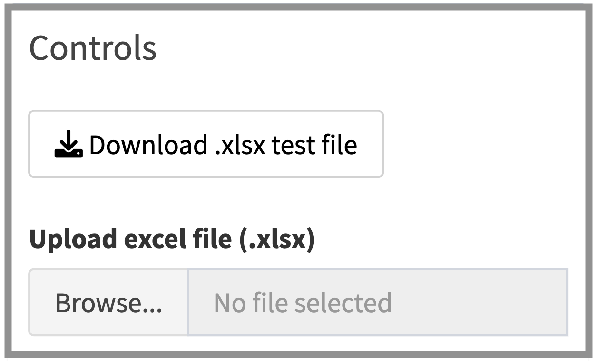

```{r, include = FALSE}
knitr::opts_chunk$set(
  collapse = FALSE,
  comment = "#>",
  fig.path='figs-introduction/',
  fig.align='center',
  prompt=T
)
```

## How to use the app?

This Shiny application can be used to generate a discharge rating curve from paired observations of stage and discharge. To start the data must be uploaded.

<br />

## 1. Upload data

To upload data, select **Browse** in the Controls section


```{r, echo=FALSE, out.width = "300px"}

```

The uploaded file must be an excel file with at least two columns named **W** and **Q**, containing the stage and discharge observations, respectively. The stage observations must be given in **centimeters** ($cm$), and the the discharge in **cubic meters per second** ($m^3/s$).
A test dataset can be downloaded by pushing **Download xlsx test file** above the Browse button.
The first row contains the column names, including **W** and **Q**, and the observations are in the corresponding columns. When uploaded, the application automatically selects only these two columns from the file.


```{r, echo=FALSE, out.width = "500px"}
knitr::include_graphics("www/excel_sheet.png")
```

<br />

## 2. Specify a Rating Curve Model

Once the data is uploaded, the Rating Curve Model can be specified. There are two model characteristics that can be adjusted to set the model complexity. First, the **Rating Curve Type** can be set to either **Generalized Power-Law** or **Power-law**. This setting specifies the type of rating curve that the mean of the model will follow. In simple terms; the Generalized Power-law rating curve is more flexible and is able to give a convincing fit to a greater number of datasets. For this reason it is selected as the default type. For more details on these rating curve differences go to **Background** in the left sidebar menu. The second model specification is to choose between a **Constant** or **Stage varying** residual variance. If set to *stage varying* then the model tries to capture any changes in the residual variance that happens over the stage values. This can improve the predictive power of the model, and is therefore selected as the default setting.


```{r, echo=FALSE, out.width = "200px"}
knitr::include_graphics("www/rc_spec.png")
```

<br />

## 3. Run The Model!

Now that the model has been specified, the Rating Curve can be generated by pressing the **Create Rating Curve** button.


```{r, echo=FALSE, out.width = "200px"}

```


Once the model has finished running, the results will be presented as Figures, Tables and Convergence Diagnostics Plots, which can all be accessed from the tab panel in the **Rating Curve Builder**.

<br />

